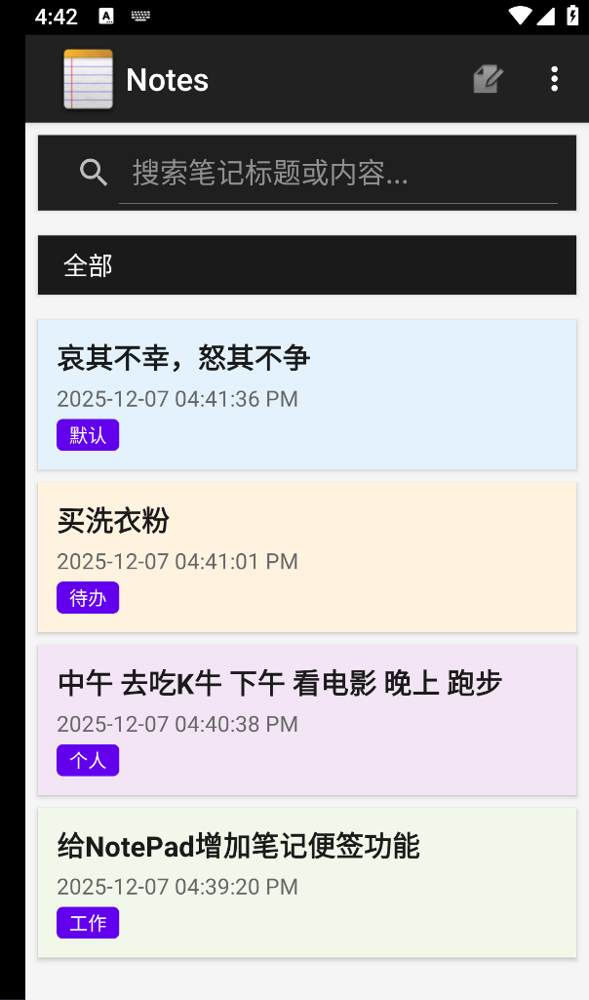
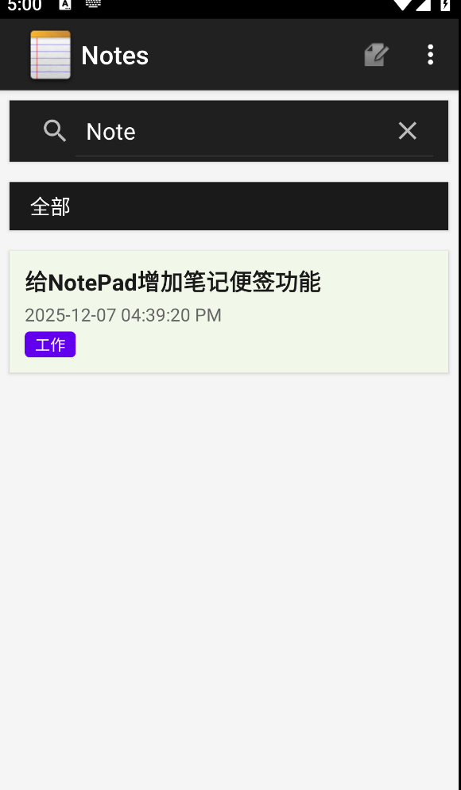
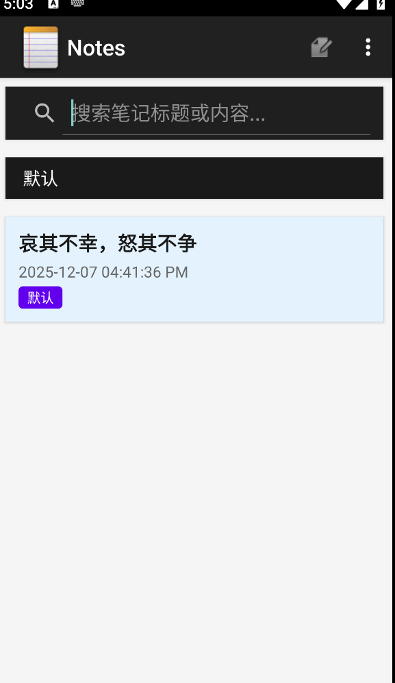
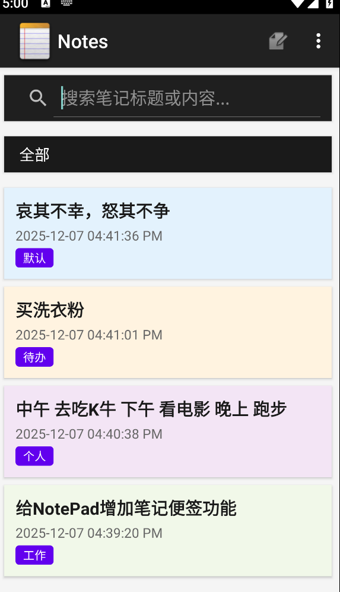
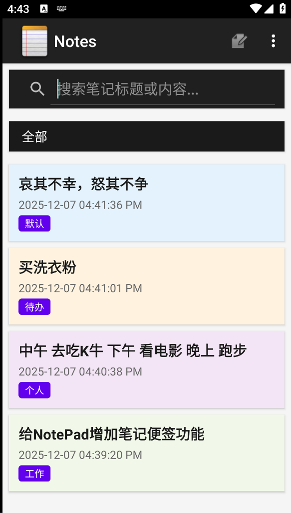
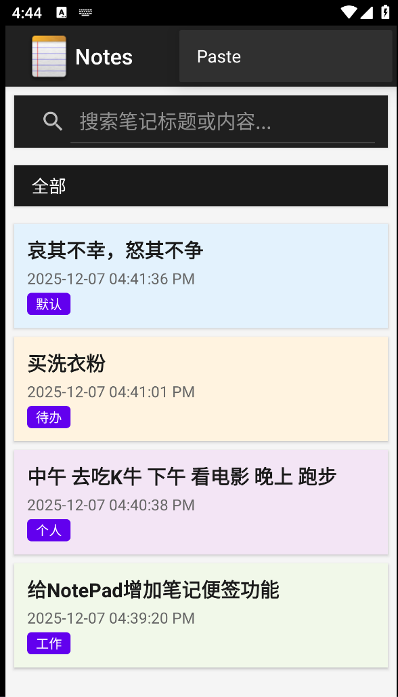
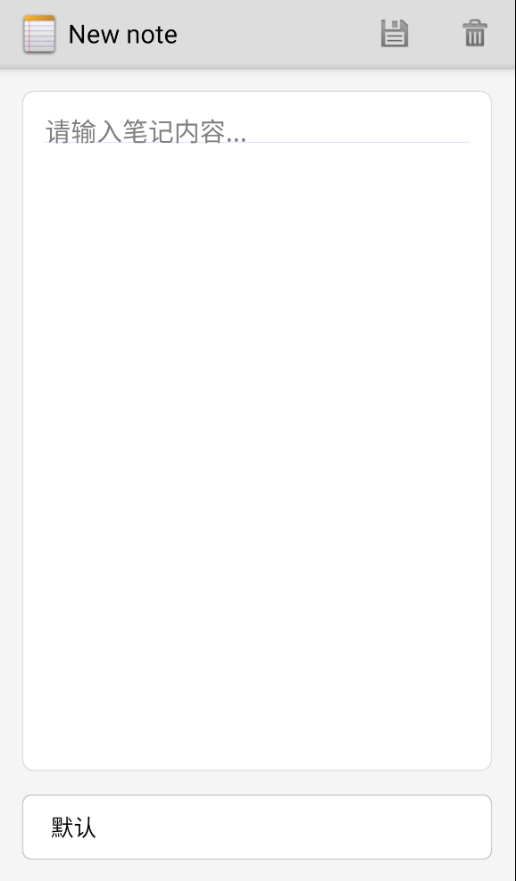
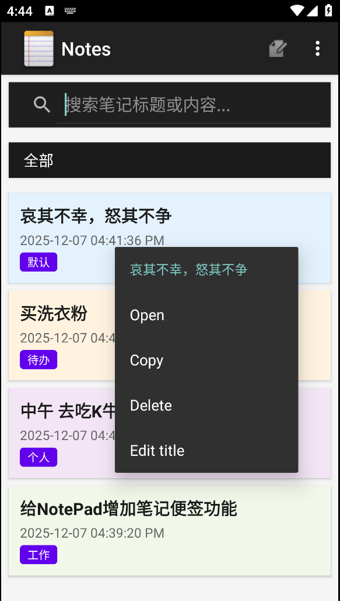

# NotePad功能说明文档

## 一、项目说明

基于NotePad添加显示时间戳、笔记搜索、笔记便签、笔记分类等功能，并且美化UI。

## 二、数据库——（notes）

### 1、数据库结构

增加最新修改笔记时间、创建笔记时间、笔记类别属性

```java
    private static final String DATABASE_CREATE = "CREATE TABLE " 
            + NotePad.Notes.TABLE_NAME + " ("
            + NotePad.Notes._ID + " INTEGER PRIMARY KEY,"
            + NotePad.Notes.COLUMN_NAME_TITLE + " TEXT,"
            + NotePad.Notes.COLUMN_NAME_NOTE + " TEXT,"
            + NotePad.Notes.COLUMN_NAME_CREATE_DATE + " INTEGER,"
            + NotePad.Notes.COLUMN_NAME_MODIFICATION_DATE + " INTEGER,"
            + NotePad.Notes.COLUMN_NAME_CATEGORY + " TEXT"  
            + ");";
```

### 2、数据库查找操作

```java
@Override
   public Cursor query(Uri uri, String[] projection, String selection, String[] selectionArgs,
           String sortOrder) {

       // Constructs a new query builder and sets its table name
       SQLiteQueryBuilder qb = new SQLiteQueryBuilder();
       qb.setTables(NotePad.Notes.TABLE_NAME);

       /**
        * Choose the projection and adjust the "where" clause based on URI pattern-matching.
        */
       switch (sUriMatcher.match(uri)) {
           // If the incoming URI is for notes, chooses the Notes projection
           case NOTES:
               qb.setProjectionMap(sNotesProjectionMap);
               break;

           /* If the incoming URI is for a single note identified by its ID, chooses the
            * note ID projection, and appends "_ID = <noteID>" to the where clause, so that
            * it selects that single note
            */
           case NOTE_ID:
               qb.setProjectionMap(sNotesProjectionMap);
               qb.appendWhere(
                   NotePad.Notes._ID +    // the name of the ID column
                   "=" +
                   // the position of the note ID itself in the incoming URI
                   uri.getPathSegments().get(NotePad.Notes.NOTE_ID_PATH_POSITION));
               break;

           case LIVE_FOLDER_NOTES:
               // If the incoming URI is from a live folder, chooses the live folder projection.
               qb.setProjectionMap(sLiveFolderProjectionMap);
               break;

           default:
               // If the URI doesn't match any of the known patterns, throw an exception.
               throw new IllegalArgumentException("Unknown URI " + uri);
       }


       String orderBy;
       // If no sort order is specified, uses the default
       if (TextUtils.isEmpty(sortOrder)) {
           orderBy = NotePad.Notes.DEFAULT_SORT_ORDER;
       } else {
           // otherwise, uses the incoming sort order
           orderBy = sortOrder;
       }

       // Opens the database object in "read" mode, since no writes need to be done.
       SQLiteDatabase db = mOpenHelper.getReadableDatabase();

       /*
        * Performs the query. If no problems occur trying to read the database, then a Cursor
        * object is returned; otherwise, the cursor variable contains null. If no records were
        * selected, then the Cursor object is empty, and Cursor.getCount() returns 0.
        */
       Cursor c = qb.query(
           db,            // The database to query
           projection,    // The columns to return from the query
           selection,     // The columns for the where clause
           selectionArgs, // The values for the where clause
           null,          // don't group the rows
           null,          // don't filter by row groups
           orderBy        // The sort order
       );

       // Tells the Cursor what URI to watch, so it knows when its source data changes
       c.setNotificationUri(getContext().getContentResolver(), uri);
       return c;
   }
```

### 3、数据库更新操作

```java
@Override
    public int update(Uri uri, ContentValues values, String where, String[] whereArgs) {

        // Opens the database object in "write" mode.
        SQLiteDatabase db = mOpenHelper.getWritableDatabase();
        int count;
        String finalWhere;

        // Does the update based on the incoming URI pattern
        switch (sUriMatcher.match(uri)) {

            // If the incoming URI matches the general notes pattern, does the update based on
            // the incoming data.
            case NOTES:

                // Does the update and returns the number of rows updated.
                count = db.update(
                    NotePad.Notes.TABLE_NAME, // The database table name.
                    values,                   // A map of column names and new values to use.
                    where,                    // The where clause column names.
                    whereArgs                 // The where clause column values to select on.
                );
                break;

            // If the incoming URI matches a single note ID, does the update based on the incoming
            // data, but modifies the where clause to restrict it to the particular note ID.
            case NOTE_ID:
                // From the incoming URI, get the note ID
                String noteId = uri.getPathSegments().get(NotePad.Notes.NOTE_ID_PATH_POSITION);

                /*
                 * Starts creating the final WHERE clause by restricting it to the incoming
                 * note ID.
                 */
                finalWhere =
                        NotePad.Notes._ID +                              // The ID column name
                        " = " +                                          // test for equality
                        uri.getPathSegments().                           // the incoming note ID
                            get(NotePad.Notes.NOTE_ID_PATH_POSITION)
                ;

                // If there were additional selection criteria, append them to the final WHERE
                // clause
                if (where !=null) {
                    finalWhere = finalWhere + " AND " + where;
                }


                // Does the update and returns the number of rows updated.
                count = db.update(
                    NotePad.Notes.TABLE_NAME, // The database table name.
                    values,                   // A map of column names and new values to use.
                    finalWhere,               // The final WHERE clause to use
                                              // placeholders for whereArgs
                    whereArgs                 // The where clause column values to select on, or
                                              // null if the values are in the where argument.
                );

                break;
            // If the incoming pattern is invalid, throws an exception.
            default:
                throw new IllegalArgumentException("Unknown URI " + uri);
        }

        /*Gets a handle to the content resolver object for the current context, and notifies it
         * that the incoming URI changed. The object passes this along to the resolver framework,
         * and observers that have registered themselves for the provider are notified.
         */

        // 通知内容观察者数据已更改
        getContext().getContentResolver().notifyChange(uri, null);

        // 添加小部件更新通知
        AppWidget.notifyWidgetUpdate(getContext());


        // Returns the number of rows updated.
        return count;
    }
```

### 4、数据库插入操作

```java
@Override
    public Uri insert(Uri uri, ContentValues initialValues) {

        // Validates the incoming URI. Only the full provider URI is allowed for inserts.
        if (sUriMatcher.match(uri) != NOTES) {
            throw new IllegalArgumentException("Unknown URI " + uri);
        }

        // A map to hold the new record's values.
        ContentValues values;

        // If the incoming values map is not null, uses it for the new values.
        if (initialValues != null) {
            values = new ContentValues(initialValues);
        } else {
            // Otherwise, create a new value map
            values = new ContentValues();
        }

        // Gets the current system time in milliseconds
        Long now = Long.valueOf(System.currentTimeMillis());

        // If the values map doesn't contain the creation date, sets the value to the current time.
        if (values.containsKey(NotePad.Notes.COLUMN_NAME_CREATE_DATE) == false) {
            values.put(NotePad.Notes.COLUMN_NAME_CREATE_DATE, now);
        }

        // If the values map doesn't contain the modification date, sets the value to the current
        // time.
        if (values.containsKey(NotePad.Notes.COLUMN_NAME_MODIFICATION_DATE) == false) {
            values.put(NotePad.Notes.COLUMN_NAME_MODIFICATION_DATE, now);
        }

        // If the values map doesn't contain a title, sets the value to the default title.
        if (values.containsKey(NotePad.Notes.COLUMN_NAME_TITLE) == false) {
            Resources r = Resources.getSystem();
            values.put(NotePad.Notes.COLUMN_NAME_TITLE, r.getString(android.R.string.untitled));
        }

        // If the values map doesn't contain note text, sets the value to an empty string.
        if (values.containsKey(NotePad.Notes.COLUMN_NAME_NOTE) == false) {
            values.put(NotePad.Notes.COLUMN_NAME_NOTE, "");
        }

        // Opens the database object in "write" mode.
        SQLiteDatabase db = mOpenHelper.getWritableDatabase();

        // Performs the insert and returns the ID of the new note.
        long rowId = db.insert(
            NotePad.Notes.TABLE_NAME,        // The table to insert into.
            NotePad.Notes.COLUMN_NAME_NOTE,  // A hack, SQLite sets this column value to null
                                             // if values is empty.
            values                           // A map of column names, and the values to insert
                                             // into the columns.
        );


        // If the insert succeeded, the row ID exists.
        if (rowId > 0) {
            // Creates a URI with the note ID pattern and the new row ID appended to it.
            Uri noteUri = ContentUris.withAppendedId(NotePad.Notes.CONTENT_ID_URI_BASE, rowId);

            // Notifies observers registered against this provider that the data changed.
            // 通知内容观察者数据已更改
            getContext().getContentResolver().notifyChange(uri, null);

            // 添加小部件更新通知
            AppWidget.notifyWidgetUpdate(getContext());

            return noteUri;
        }

        // If the insert didn't succeed, then the rowID is <= 0. Throws an exception.
        throw new SQLException("Failed to insert row into " + uri);
    }
```

### 5、数据库删除操作

```java
@Override
    public int delete(Uri uri, String where, String[] whereArgs) {

        // Opens the database object in "write" mode.
        SQLiteDatabase db = mOpenHelper.getWritableDatabase();
        String finalWhere;

        int count;

        // Does the delete based on the incoming URI pattern.
        switch (sUriMatcher.match(uri)) {

            // If the incoming pattern matches the general pattern for notes, does a delete
            // based on the incoming "where" columns and arguments.
            case NOTES:
                count = db.delete(
                    NotePad.Notes.TABLE_NAME,  // The database table name
                    where,                     // The incoming where clause column names
                    whereArgs                  // The incoming where clause values
                );
                break;

                // If the incoming URI matches a single note ID, does the delete based on the
                // incoming data, but modifies the where clause to restrict it to the
                // particular note ID.
            case NOTE_ID:
                /*
                 * Starts a final WHERE clause by restricting it to the
                 * desired note ID.
                 */
                finalWhere =
                        NotePad.Notes._ID +                              // The ID column name
                        " = " +                                          // test for equality
                        uri.getPathSegments().                           // the incoming note ID
                            get(NotePad.Notes.NOTE_ID_PATH_POSITION)
                ;

                // If there were additional selection criteria, append them to the final
                // WHERE clause
                if (where != null) {
                    finalWhere = finalWhere + " AND " + where;
                }

                // Performs the delete.
                count = db.delete(
                    NotePad.Notes.TABLE_NAME,  // The database table name.
                    finalWhere,                // The final WHERE clause
                    whereArgs                  // The incoming where clause values.
                );
                break;

            // If the incoming pattern is invalid, throws an exception.
            default:
                throw new IllegalArgumentException("Unknown URI " + uri);
        }

        /*Gets a handle to the content resolver object for the current context, and notifies it
         * that the incoming URI changed. The object passes this along to the resolver framework,
         * and observers that have registered themselves for the provider are notified.
         */
        // 通知内容观察者数据已更改
        getContext().getContentResolver().notifyChange(uri, null);

        // 添加小部件更新通知
        AppWidget.notifyWidgetUpdate(getContext());


        // Returns the number of rows deleted.
        return count;
    }
```


## 三、功能说明

### 1、基础功能

#### ①、时间戳显示

##### 功能说明

本功能在每条笔记的标题下方自动生成并显示一个精确到分钟（含AM/PM标识）的时间戳。该时间戳清晰地记录了笔记的最后创建或编辑时间，并结合分类标签，帮助用户快速定位、检索和管理笔记。

##### 效果展示



#### ②、笔记搜索

##### 功能说明

本功能够在主界面根据笔记标题模糊搜索笔记，并且可以搭配分类选择功能，进行更加细化的搜索，方便用户对笔记的管理以及选择。

##### 效果展示



### 2、额外功能

#### ①、笔记便签

##### 功能说明

本功能可以在桌面添加一个小组件，组将可以展示最近更新的一条笔记的标题和部分内容，点击组件可以直接进入app的主界面。

##### 效果展示


#### ②、笔记分类

功能说明

本功能为笔记增加类别选择，有如全部、默认、工作、个人和待办等类别。在编辑笔记时为笔记设定类别，在笔记展示时可以根据分类搜索展示笔记，且为不同类别的笔记有不同的背景色。

##### 效果演示

###### a、编辑笔记



###### b、搜索笔记





###### c、笔记不同类别颜色



#### ③、美化UI

##### 功能说明

在现有清晰、简洁的布局基础上，通过引入现代设计语言、优化视觉层次和增加微交互，提升应用的整体质感、专业度和使用愉悦感，打造一款既美观又高效的笔记工具。

##### 效果展示










## 四、改进之处

1、可以对笔记便签增加选择指定笔记展示的功能

2、扩展编辑笔记时修改笔记标题的功能

3、增加可自由扩展分类类别的功能
